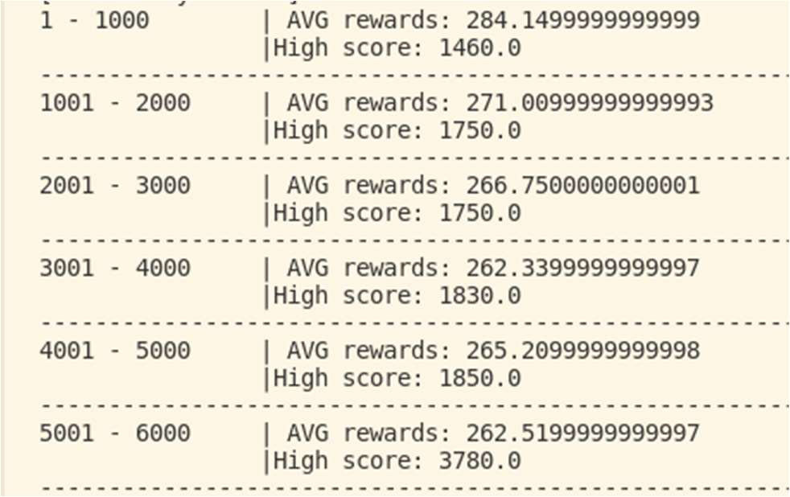

# rl-ms-pacman

## Install requirements
1. Clone repo
2. Create Python virtual environment
3. pip install -r requirements.txt

## demo.py

A demo that loads the saved model and shows trained agent playing game

## train.py

A file to train an agent from scratch and save weights of model to saved_model folder.

## policy.py

The policy class for the Ms. Pac-Man agent. It contains the forward and backward policy methods for calculating the weights of the neural network in each pass. There are Nine policy networks corresponding to each action. Each forward pass through the policy networks result in the probability of taking each specific action. The backward pass through the network uses the gradients calculated from the rewards from the previous batch to update the policy.

## Results

High score steadily increases with number of training games played. AVG score remains flat because of increased exploration as more of map is discovered.

